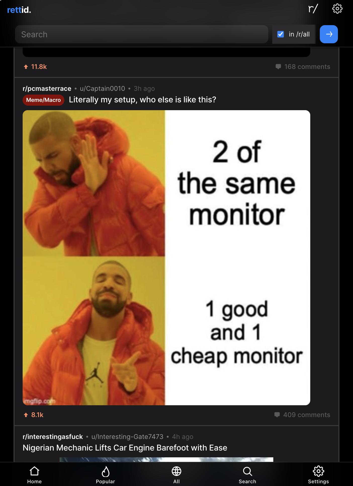

# Rettid

> **A Reddit front-end that feels like a native mobile app — private, adless, and installable.**
>
> Rettid is a fork of [Redlib](https://github.com/redlib-org/redlib) (itself descended from [Libreddit](https://github.com/libreddit/libreddit)). It keeps Redlib's privacy guarantees and adds the mobile experience Redlib deliberately doesn't ship.



---

## Why this fork exists

Redlib is excellent at what it sets out to be: a fast, minimal, JavaScript-free Reddit proxy. That minimalism is a deliberate design constraint, and it means a few things are explicitly out of scope upstream — a mobile-app-style interface, offline support, and any HTTP API a JavaScript client could consume.

Rettid is where those things live. **The objective: make a self-hosted Reddit front-end that's genuinely pleasant on a phone, works offline, and can serve as a backend for custom clients — without giving up the privacy properties that made Redlib worth using.**

Concretely, that means three additions on top of upstream:

| | Feature | Why |
|---|---|---|
| 📱 | **Voyager layout** — a mobile-first skin with a bottom tab bar, sticky top bar, and card feed | Redlib's layouts are desktop-shaped; this one is built for thumbs |
| 📶 | **Installable PWA** — service worker, manifest, offline fallback, media caching | Add to home screen, browse on bad connections |
| 🔌 | **Opt-in JSON API** — allowlisted read-only Reddit passthrough | Build your own client without your own Reddit credentials |

Everything Redlib already did well is inherited unchanged: Rust, no tracking, server-side media proxying, strict CSP, and full compatibility with existing `REDLIB_*` configuration.

### What's kept from Redlib

- 🚀 **Fast** — Rust, no client-side framework, no hydration step
- ☁️ **Light** — no ads, no trackers, no bloat; the classic layouts remain JavaScript-free
- 🕵 **Private** — every request, including media, is proxied server-side; the browser never contacts Reddit
- 🔒 **Secure** — strict [Content Security Policy](https://developer.mozilla.org/en-US/docs/Web/HTTP/CSP)
- ⚙️ **Drop-in** — same env vars, same config file format, same routes

> [!NOTE]
> **Scope and status.** This is a personally maintained fork for self-hosting. It isn't listed in the public Redlib instance directory, doesn't publish prebuilt binaries or container images, and the changes here aren't intended to be upstreamed as-is — they run counter to Redlib's no-JS philosophy by design. If you want vanilla Redlib, use [upstream](https://github.com/redlib-org/redlib); it's the better choice for that.

---

## Table of Contents

1. [Why this fork exists](#why-this-fork-exists)
2. [The three additions](#the-three-additions)
   - [Voyager layout](#voyager-layout)
   - [PWA / offline support](#pwa--offline-support)
   - [JSON API](#json-api)
3. [Quick start](#quick-start)
4. [Deployment](#deployment)
   - [Docker](#docker)
   - [Podman](#podman)
   - [Binary](#binary)
   - [Building from source](#building-from-source)
   - [launchd (macOS)](#launchd-macos)
5. [Configuration](#configuration)
   - [Command line flags](#command-line-flags)
   - [Instance settings](#instance-settings)
   - [Default user settings](#default-user-settings)
   - [Forward proxies](#forward-proxies)
6. [Privacy](#privacy)
7. [Inherited from Redlib](#inherited-from-redlib)
8. [Building & security notes](#building--security-notes)

---

# The three additions

## Voyager layout

A mobile-first layout inspired by [Voyager for Lemmy](https://github.com/aeharding/voyager) and Apollo-era Reddit clients. Enable it per-user in **Settings → Layout → voyager**, or instance-wide:

```bash
REDLIB_DEFAULT_LAYOUT=voyager
```

What it changes:

- Bottom tab bar for primary navigation (Home / Popular / All / Search / Settings)
- Sticky, translucent top bar instead of a fixed desktop navbar
- Full-bleed media, card-style feed, iOS-like geometry and spacing
- Comment scores inline beside the author rather than in a left-hand column
- Safe-area (notch) awareness and `theme-color` matching, so it looks right installed

It is **purely presentational**. All CSS lives in `static/voyager.css` scoped to `body.voyager`, and the template changes are wrapped in `` conditionals. Selecting `card`, `clean`, or `compact` gives you exactly upstream's rendering — this layout can't leak into them.

> [!TIP]
> The tab bar only exists in the `voyager` layout. If you're on `card` and wondering where it went, that's expected.

## PWA / offline support

The instance is installable and usable offline, regardless of which layout you pick. It serves a web app manifest (`/manifest.json`) and registers a service worker (`/sw.js`) with three caching strategies:

| Content | Strategy |
|---|---|
| App shell (CSS, JS, fonts, icons) | Cache-first, revalidated in the background |
| Proxied media (`/img`, `/thumb`, `/preview`, …) | Cache-first and treated as immutable, size-capped |
| HTML navigations | Network-first, falling back to `/offline.html` |

HTML is deliberately network-first: preferences live in cookies, so serving a stale page could show the wrong theme or feed. Settings and streaming media (`/settings`, `/vid/`, `/hls/`) are never cached. Cache names embed the crate version, so each release prunes its predecessors on activation.

No configuration needed — it's part of the base install. The cache is entirely client-side and clears like any other site data.

## JSON API

An opt-in, read-only passthrough to Reddit's JSON endpoints, so a JavaScript client can be built against your instance without needing its own Reddit credentials or rate limit.

```bash
REDLIB_ENABLE_JSON_API=on
# Optional: allow a separate dev frontend to call it
REDLIB_API_CORS_ORIGIN=http://localhost:5173
```

```
GET /api/reddit/<reddit-path>[?query]
```

Requests are forwarded through the same internal client the HTML pages use, so they inherit the instance's OAuth token, rate-limit accounting, and retry behavior. The browser never talks to Reddit directly.

- **Off by default.** It exposes only public data the HTML frontend already renders, but it's far easier to script against and spends your instance's rate limit, so it's opt-in.
- **Allowlisted, not an open proxy.** Forwarded prefixes: `r/`, `user/`, `comments/`, `subreddits/`, `api/info`, `by_id/`, `search`, `duplicates/`, `api/morechildren`. Traversal (`..`) and absolute paths are rejected.
- **CORS is off unless configured.** Same-origin only by default; `OPTIONS` preflight is handled once an origin is set.
- **Raw responses.** No translation is done server-side — mapping Reddit's shapes to your client's types is the client's job.

The motivating use case: the HTML templates render scores and timestamps as pre-formatted display strings, which is fine for a server-rendered page but useless to a JS client that needs the raw numbers.

---

# Quick start

```bash
git clone https://github.com/gbrunoo/redlib-revamped && cd redlib-revamped
cargo run
```

Then open <http://localhost:8080> and set **Settings → Layout → voyager** to see the mobile skin.

> [!IMPORTANT]
> This project builds BoringSSL from source. See [Building & security notes](#building--security-notes) for prerequisites if the build fails.

---

# Deployment

Docker is the easiest path for a long-running instance. Since this fork publishes no images or binaries, every route below builds from source.

## Docker

Build your own image from the provided Dockerfiles:

```bash
docker build -f Dockerfile.alpine -t rettid .
docker run -d --name rettid -p 8080:8080 --env-file .env rettid
```

Behind a reverse proxy, bind to loopback instead: `-p 127.0.0.1:8080:8080`.

### Docker Compose

`compose.yaml` is set up to build locally and read `.env`:

```bash
cp .env.example .env   # edit as desired
docker compose up -d
docker logs -f rettid
```

## Podman

A Quadlet unit is provided in `rettid.container`. Build the image first, then:

```bash
podman build -f Dockerfile.alpine -t rettid .
cp rettid.container .env.example ~/.config/containers/systemd/
systemctl --user daemon-reload
systemctl --user start rettid.service
systemctl --user status rettid.service
```

> [!IMPORTANT]
> Requires a systemd-based distro with Podman, plus `loginctl enable-linger <username>` so the service survives logout. The unit references `localhost/rettid:latest` — adjust if you tag differently.

## Binary

After `cargo build --release`, the binary is `target/release/rettid`:

```bash
sudo install -o root -g root -m 755 target/release/rettid /usr/bin/rettid
rettid
```

> [!IMPORTANT]
> If proxying through NGINX, add `proxy_http_version 1.1;` above your `proxy_pass` line.

### Running as a systemd service

Install `contrib/rettid.service` to `/etc/systemd/system/rettid.service`, and optionally configure it via `/etc/rettid.conf` (template: `contrib/rettid.conf`).

If NGINX runs on the same host, make it wait for the service. In `/etc/systemd/system/rettid.service.d/reverse-proxy.conf`:

```conf
[Unit]
Before=nginx.service
```

## Building from source

```bash
git clone https://github.com/gbrunoo/redlib-revamped && cd redlib-revamped
cargo build --release
```

## launchd (macOS)

```bash
cp contrib/rettid.plist ~/Library/LaunchAgents/
launchctl load ~/Library/LaunchAgents/rettid.plist
```

---

# Configuration

Environment variables keep upstream's `REDLIB_*` prefix, so existing Redlib configs work unchanged:

```bash
REDLIB_DEFAULT_SHOW_NSFW=on rettid
REDLIB_DEFAULT_LAYOUT=voyager REDLIB_DEFAULT_THEME=voyagerDark rettid
```

Or use a `redlib.toml` file:

```toml
REDLIB_DEFAULT_LAYOUT = "voyager"
REDLIB_DEFAULT_USE_HLS = "on"
```

> [!NOTE]
> With Docker CLI or Compose, copy `.env.example` to `.env` and edit it. Docker CLI: add `--env-file .env`. Compose already wires it up via `env_file: .env`.

## Command line flags

- `-4`, `--ipv4-only` — listen on IPv4 only
- `-6`, `--ipv6-only` — listen on IPv6 only
- `-a`, `--address <ADDRESS>` — address to bind. Default `[::]`
- `-p`, `--port <PORT>` — port to bind. Default `8080`
- `-H`, `--hsts <EXPIRE_TIME>` — HSTS max-age. Default `604800`
- `-r`, `--redirect-https` — no longer functional

## Instance settings

Prefix each with `REDLIB_`:

| Name | Possible values | Default | Description |
|---|---|---|---|
| `SFW_ONLY` | `["on", "off"]` | `off` | Filter all NSFW content instance-wide |
| `BANNER` | String | (empty) | Banner shown on the instance info page |
| `ROBOTS_DISABLE_INDEXING` | `["on", "off"]` | `off` | Ask search engines not to index this instance |
| `PUSHSHIFT_FRONTEND` | String | `undelete.pullpush.io` | Frontend used for "removed" post links |
| `PORT` | Integer 0-65535 | `8080` | **Internal** listen port |
| `ENABLE_RSS` | `["on", "off"]` | `off` | Enable RSS feed generation |
| `FULL_URL` | String | (empty) | Public base URL; currently only needed for RSS |
| `ENABLE_JSON_API` | `["on", "off"]` | `off` | Expose the read-only [JSON API](#json-api) at `/api/reddit/*` |
| `API_CORS_ORIGIN` | String | (empty) | `Access-Control-Allow-Origin` for the JSON API. Unset ⇒ same-origin only |

## Default user settings

Prefix each with `REDLIB_DEFAULT_`. These set the default; users can override them in Settings.

| Name | Possible values | Default |
|---|---|---|
| `THEME` | `["system", "light", "dark", "black", "dracula", "nord", "laserwave", "violet", "gold", "rosebox", "gruvboxdark", "gruvboxlight", "tokyoNight", "icebergDark", "doomone", "libredditBlack", "libredditDark", "libredditLight", "voyagerDark", "voyagerLight"]` | `system` |
| `FRONT_PAGE` | `["default", "popular", "all"]` | `default` |
| `LAYOUT` | `["card", "clean", "compact", "voyager"]` | `card` |
| `WIDE` | `["on", "off"]` | `off` |
| `POST_SORT` | `["hot", "new", "top", "rising", "controversial"]` | `hot` |
| `COMMENT_SORT` | `["confidence", "top", "new", "controversial", "old"]` | `confidence` |
| `BLUR_SPOILER` | `["on", "off"]` | `off` |
| `SHOW_NSFW` | `["on", "off"]` | `off` |
| `BLUR_NSFW` | `["on", "off"]` | `off` |
| `USE_HLS` | `["on", "off"]` | `off` |
| `HIDE_HLS_NOTIFICATION` | `["on", "off"]` | `off` |
| `AUTOPLAY_VIDEOS` | `["on", "off"]` | `off` |
| `SUBSCRIPTIONS` | `+`-delimited subreddits (`sub1+sub2+sub3`) | _(none)_ |
| `HIDE_AWARDS` | `["on", "off"]` | `off` |
| `DISABLE_VISIT_REDDIT_CONFIRMATION` | `["on", "off"]` | `off` |
| `HIDE_SCORE` | `["on", "off"]` | `off` |
| `HIDE_SIDEBAR_AND_SUMMARY` | `["on", "off"]` | `off` |
| `FIXED_NAVBAR` | `["on", "off"]` | `on` |
| `REMOVE_DEFAULT_FEEDS` | `["on", "off"]` | `off` |

## Forward proxies

Outbound requests [honor](https://docs.rs/wreq/latest/wreq/#proxies) the standard `HTTP_PROXY` / `HTTPS_PROXY` variables; `ALL_PROXY` sets both.

Supported schemes: `http://`, `https://`, `socks4://`, `socks4a://`, `socks5://`, `socks5h://`.

---

# Privacy

**What Reddit collects.** Per Reddit's [privacy policy](https://www.redditinc.com/policies/privacy-policy) and [cookie notice](https://www.redditinc.com/policies/cookies): IP address, user-agent, browser and OS, referral URLs, device IDs and settings, pages visited, links clicked, and search terms; location via GPS, Bluetooth, or IP where consented; and cookies for authentication, functionality, analytics, advertising, and third-party tracking.

**What Rettid collects.**

- **Logging** — nothing in release builds. Debug builds log fetched post IDs to aid troubleshooting.
- **Cookies** — first-party only, storing just the settings you choose. No personal data, never cross-site.
- **PWA cache** — static assets and already-proxied media, cached in your own browser. Nothing is sent to a third party; clear it like any other site data.
- **Media** — proxied through the server, so Reddit's CDNs never see your IP.

---

# Inherited from Redlib

Rettid inherits all of this from upstream, unchanged.

**Built with:** [Rust](https://www.rust-lang.org/) · [Hyper](https://github.com/hyperium/hyper) (HTTP server) · [wreq](https://github.com/0x676e67/wreq) with BoringSSL (outbound requests) · [Askama](https://github.com/askama-rs/askama) (templates)

**How Redlib evades rate limits:**

- **OAuth token spoofing** — mimics the official Android client's OAuth flow (iOS was tried, but anonymous iOS clients hit tighter content restrictions)
- **Token refreshing** — rotates the auth token every 24 hours, like the real app
- **Header mimicking** — forwards as many of the official app's headers as possible

**Relationship to Libreddit:** Redlib began as a Libreddit fork and was renamed for trademark reasons — Reddit only permits their name in the form "XYZ For Reddit." Same reasoning applies here, which is why this fork is "Rettid" rather than anything containing "reddit."

Find upstream Redlib on 💬 [Matrix](https://matrix.to/#/#redlib:matrix.org) · :octocat: [GitHub](https://github.com/redlib-org/redlib) · 🦊 [GitLab](https://gitlab.com/redlib/redlib), and its public instances in the [redlib-instances](https://github.com/redlib-org/redlib-instances) repo.

> [!TIP]
> 🔗 To redirect Reddit links to your instance automatically, use [LibRedirect](https://github.com/libredirect/libredirect) or [Privacy Redirect](https://github.com/SimonBrazell/privacy-redirect).

---

# Building & security notes

TLS goes through [BoringSSL](https://boringssl.googlesource.com/boringssl/), built from source with patches from the [wreq](https://github.com/0x676e67/wreq) project. Certificates validate against an embedded Mozilla trust store.

Because [`boring-sys2`](https://crates.io/crates/boring-sys2) compiles BoringSSL, the build needs a C/C++ toolchain.

**Linux / macOS** — see the [BoringSSL build docs](https://github.com/google/boringssl/blob/main/BUILDING.md) for dependencies (typically `cmake`, `perl`, `pkg-config`, `libclang`).

**Windows** — MSVC is likely already installed with Rust; then:

```pwsh
# -i keeps installers interactive, since some don't update PATH on their own.
winget install -i Kitware.CMake
winget install -i NASM.NASM
winget install -i LLVM.LLVM

# For tests.
winget install GoLang.Go
```

---

**License:** AGPL-3.0-only, same as upstream Redlib. See [LICENSE](LICENSE) and [CREDITS](CREDITS).
